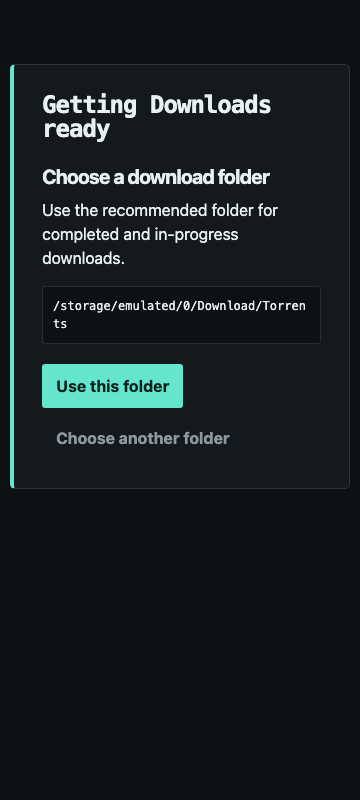

# TorrentWebUiForAndroid

A browser-first, self-hosted torrent downloader for Android. The Android app handles permissions, onboarding, and daemon lifecycle; the authenticated WebUI provides the primary experience to browsers on the local network.



> [!WARNING]
> This project is under active development and has no supported production release yet. Automated emulator acceptance is extensive, but final physical-device and separate-LAN browser acceptance is still pending. Do not expose the WebUI directly to the public Internet.

## Highlights

- Consumer-oriented download queue with add, pause, resume, details, move, recovery, and safe removal flows.
- Responsive WebUI for phone, tablet, and desktop browsers.
- Password authentication enabled by default.
- Canonical Android filesystem destinations constrained to backend-validated shared/external storage volumes.
- Native libtorrent engine behind a narrow JNI boundary.
- Local-only operation with no telemetry or cloud dependency.

## Requirements

- Android 13 or newer (`minSdk 33`).
- 64-bit ARM device (`arm64-v8a`).
- Android **All Files Access** for shared/external download destinations.
- A trusted local network for browser access.

## Build from source

```bash
git clone --recurse-submodules https://github.com/wayfarer-rus/TorrentWebUiForAndroid.git
cd TorrentWebUiForAndroid
./scripts/bootstrap-deps.sh
cd web && npm ci && cd ..
./gradlew :app:assembleDebug
```

The debug APK is written to `app/build/outputs/apk/debug/app-debug.apk`. See [BUILD_AND_RUN.md](BUILD_AND_RUN.md) for SDK/NDK prerequisites, installation, development, and test commands.

## Security

The WebUI is LAN-oriented and authenticated, but a password is not a substitute for network isolation. Change the bootstrap password during onboarding, use the app only on trusted networks, and never configure public router forwarding to the WebUI port. See [SECURITY.md](SECURITY.md) and the [security model](docs/security-model.md).

Please use torrents only for content you are legally entitled to download or distribute.

## Project status and validation

Milestones 1–7 implement the native engine, Android daemon, authenticated server, path-based storage, onboarding, and instrumented consumer WebUI. The current automated baseline includes JVM, browser, Android instrumentation, and deterministic emulator/native storage acceptance. Physical-device and separate-LAN release gates remain open; see [TEST_REPORT.md](TEST_REPORT.md) and [ROADMAP.md](ROADMAP.md).

## Repository guide

- [BUILD_AND_RUN.md](BUILD_AND_RUN.md) — setup, build, install, and test commands
- [ARCHITECTURE.md](ARCHITECTURE.md) — system boundaries and module responsibilities
- [CONTRIBUTING.md](CONTRIBUTING.md) — contribution workflow
- [DECISIONS.md](DECISIONS.md) and [docs/adr/](docs/adr/) — architectural decisions
- [THIRD_PARTY_NOTICES.md](THIRD_PARTY_NOTICES.md) — dependency and license inventory
- [AGENTS.md](AGENTS.md) — repository engineering contract

## License

Original project code is licensed under the [Apache License 2.0](LICENSE). Third-party components retain their own licenses; see [NOTICE](NOTICE) and [THIRD_PARTY_NOTICES.md](THIRD_PARTY_NOTICES.md). The `libtorrent/` submodule is not relicensed by this project.
